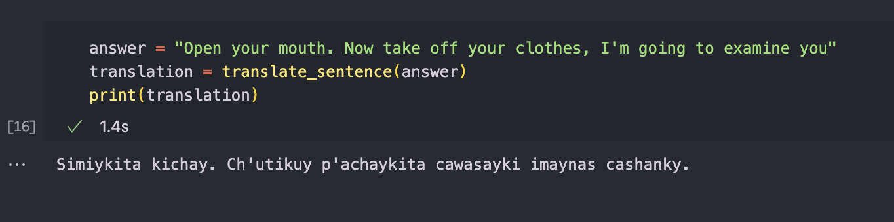

# T-RAG-o: Translation RAG online 🥃

Achieving translation using a RAG process. Inspired by [this](https://medium.com/@vatsalparasaniya/indic-translation-using-rag-e45748543139) article.

> [!Note] 
> This repo accomplishes an English to Cuzco Quechua translation example.

## 📚 Prerequisites
1. Translation dataset in Hugging Face `(phrases in one language and its respective translation)`. Check [this one](https://huggingface.co/datasets/pollitoconpapass/eng-quz-translation-dataset) out as example.

2. LLM available `(I'll be using Azure gpt-4o)`

3. A vector store retriever and its API key `(I'll be using Pinecone)`

## ⚙️ Configuration

1. Create a .env file with these values

        PINECONE_API_KEY=
        PINECONE_INDEX_NAME=

        AZURE_ASSISTANT_API_KEY=
        AZURE_ASSISTANT_API_VERSION=
        AZURE_ASSISTANT_DEPLOYMENT_ID=
        AZURE_ASSISTANT_DOMAIN=

2. Install all the requirements

        pip install -r requirements.txt

3. In the Jupyter Notebook: `pinecone_process.ipynb` change the `Load general data` cell with your own data.

## 🧑‍💻 Implementation

- Follow the Jupyter Notebook cells and the labels present.
- `test_translate.py` is the Python script to test the translation alone.
- `examples/words.json` in case you want to add some special custom words 
- `examples/ingest_json_2_pinecone.ipynb` the script to add those custom words to the Pinecone index

## 🌍 Translation Example

> [!IMPORTANT] 
> Please notice that you can change the script to accommodate your own tools and data
